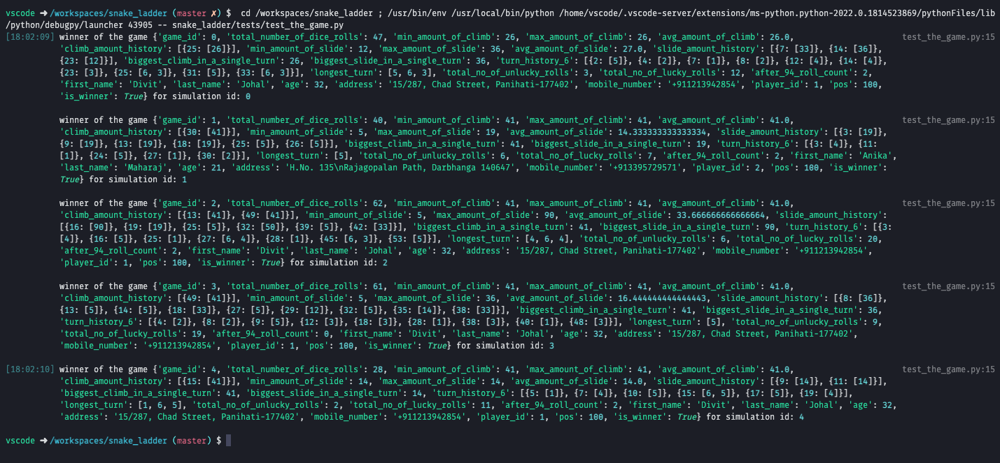

1. Minimum/Average/Maximum number of rolls needed to win.
   1. `total_number_of_dice_rolls` per player untill the player wins, during the entire game. Once N number of games/simulations are done, we can generate a player wise min/avg/max or for all the games/simulation for all player can be summed up together to have a each game level view.

2. Minimum/Average/Maximum amount of climbs during the game
3. Minimum/Average/Maximum amount of slides during the game
   1. for both the above (2,3) need to store the climb and slide amount during the game. once the game is finished we can calculate the avg/min/max for amount of climb or slide.

4. **How to Run**
   1. To run the simulation pls use `snake_ladder/tests/test_the_game.py`
   2. It contains inputs(mandetory and optional) to game. For ex. `simulation_count`, `num_of_ladders`, `num_of_snakes`, `num_of_players` are mandetory. `dice_count` and `board_size` is optional.
   3. Also there is a debug profile is set named as `play snake and ladder` inside `.vscode/launch.json`. This can launched easily from the debug tab of vscode. This also sets the `PYTHONPATH` which is required for package discovery.

5. Few of the places code needs improvement:
   1. Object validation check
   2. Introduction of exception class alinged with-in the context of the game.
   3. Module / Class doc strings
   4. Add Linting

6. How to configure this workspace
   1. This repo contains `.devcontainer` and `.vscode` metadata folers. Using `Remote-Containers: Clone Repository in Named Container Volume` in vscode it can be easily cloned. Metadata files would help to configure swiftly.
   2. Though it requires extension named `Remote - Containers`. Using extension id is `ms-vscode-remote.remote-containers` it can be installed swiftly.

